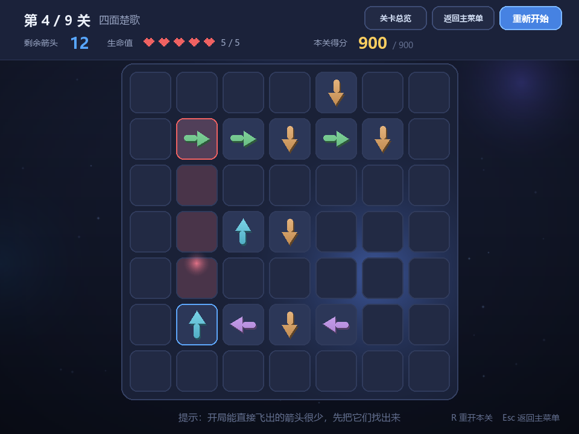
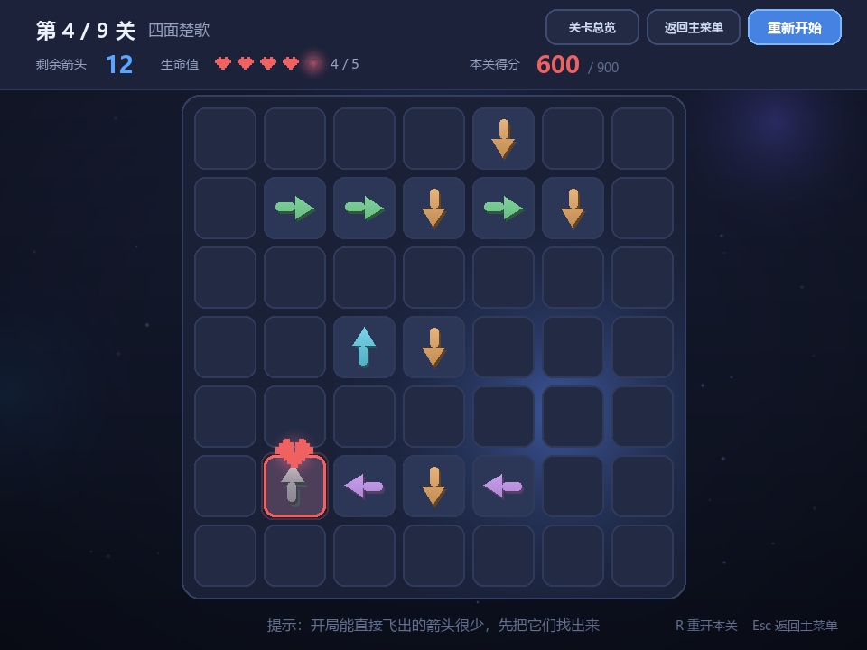
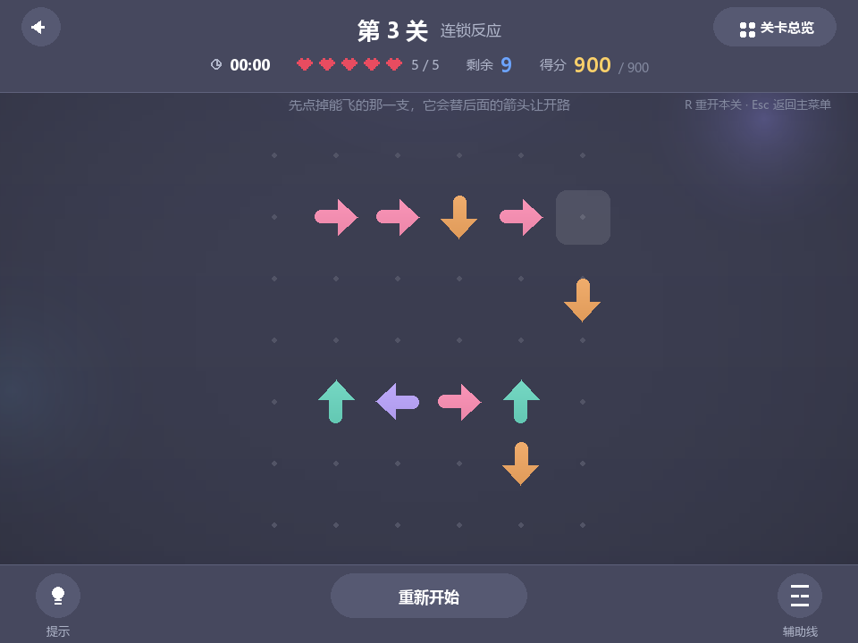
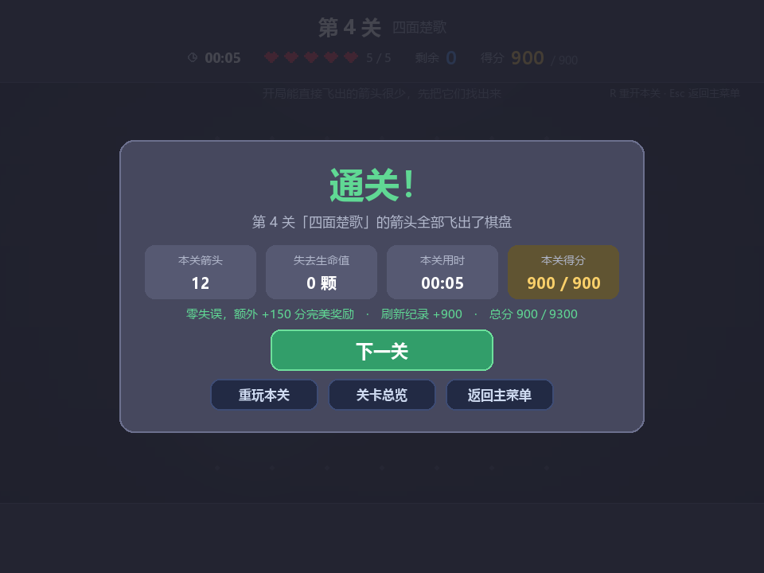
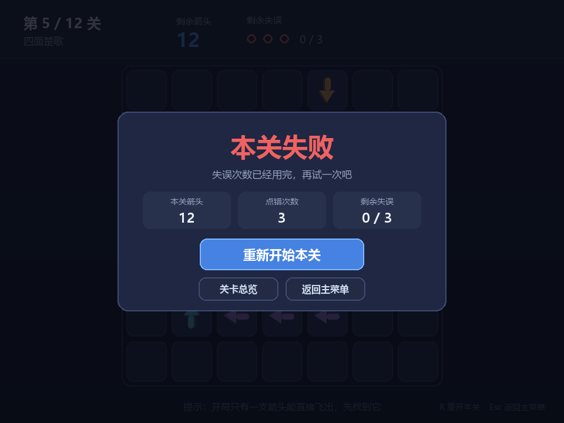
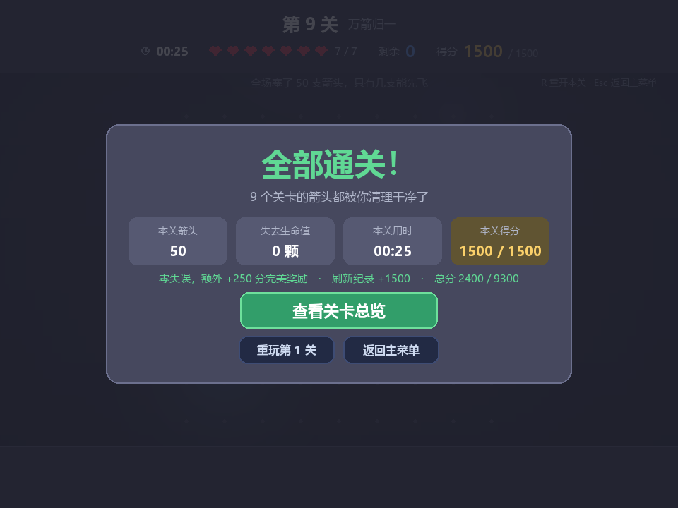
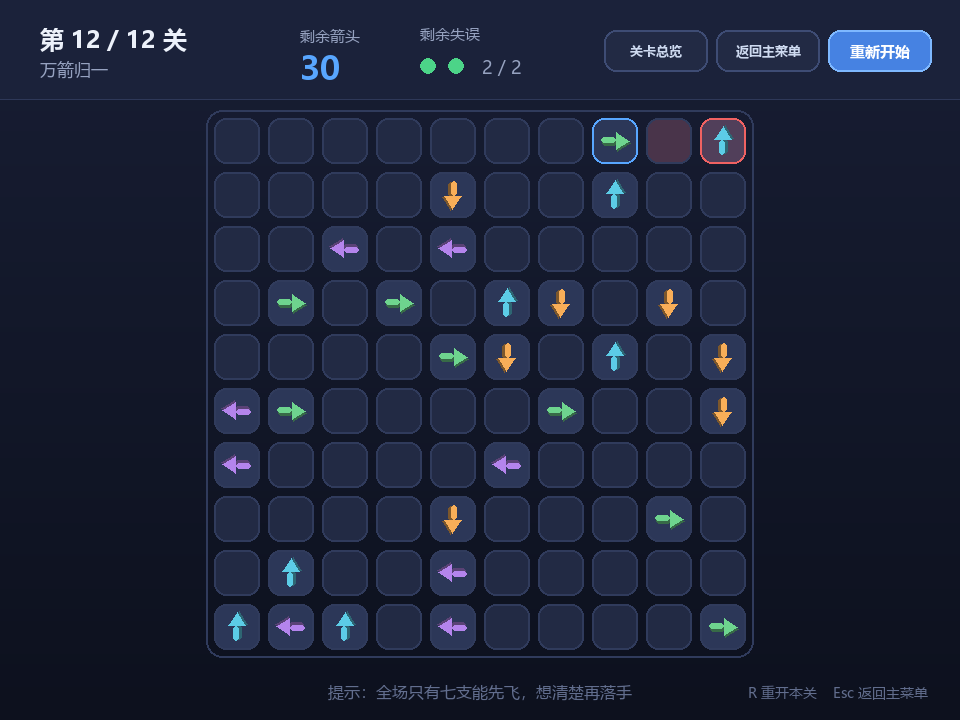
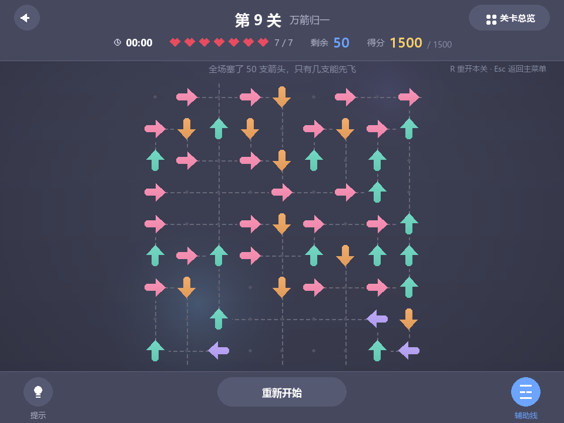
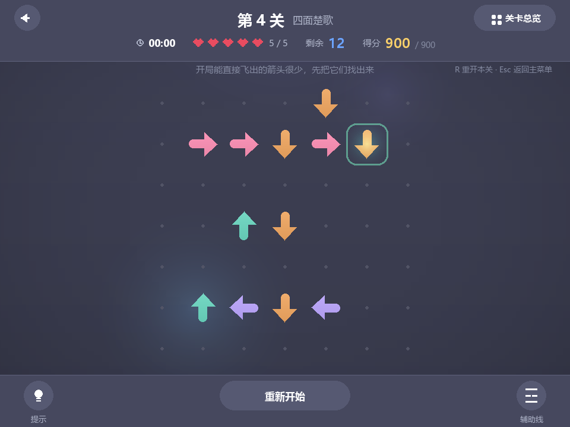

# 一箭又一箭（One Arrow After Another）

一个用 **Python + Pygame** 编写的点击式箭头解谜小游戏。项目为软件工程课程第二次个人作业，
参考微信小游戏《一箭又一箭》的核心玩法实现，开发过程使用 AIGC 工具辅助。

> **作者**：周山翔　|　**仓库**：<https://github.com/zsx123456/one-arrow-after-another>
> **博客（AIGC 使用记录 + 测试记录）**：[`docs/blog.md`](docs/blog.md)

---

## 一、游戏简介

棋盘上散布着朝向「上 / 下 / 左 / 右」四个方向的箭头。玩家点击某个箭头：

* 如果它前进方向上**没有其它箭头阻挡**，箭头会沿着自己的方向飞出棋盘并被消除；
* 如果前进方向上**存在其它箭头**，箭头不会消失，而是前冲一下再弹回、抖动、泛红，
  **并丢掉一颗心**；
* 清空本关全部箭头即可通关，剩下的心越多，本关得分越高；心用光则本关失败，可以重新开始。


> 上面这段演示 GIF 由 `tools/make_demo_gif.py` 无头录制：悬停看路径 → 开辅助线、
> 点一次提示 → 点错丢一颗心 → 点对了飞出去 → 连锁清空 → 通关结算。

**顺手给玩家配了三个小工具**（都摆在界面上，不用记快捷键）：

* **提示**：在「现在能飞出去的箭头」里自动挑一支**消掉之后能解锁最多其它箭头**的，
  套上一圈会呼吸的青绿高亮环，几秒后自己消失——不会一直挂着让人误以为那格有什么特殊状态；
* **辅助线**：把每支箭头前进方向的去路用虚线画出来（去路畅通的画到棋盘边，
  被挡住的停在挡路那一支跟前）。两种情况**用同一个颜色**：它只帮你把方向关系看清楚，
  不替你做判断——真按「能不能飞」上色，等于把答案画在脸上；
* **计时**：本关用时从开局开始走，通关 / 失败那一刻就停住，
  结算面板里会列出「本关用时」。它只做记录，不参与计分，超时也不会判负。

**1 个教学关 + 9 个正式关卡**：教学关是**独立入口**（不计分、不占关卡编号、随时可以回去复习），
9 个正式关难度递增，棋盘从 5×5 扩到 9×9，箭头从 4 支增加到 50 支。
所有关卡都由程序校验过可解性。

**关卡总览**：一眼看清每一关的通关状态、难度星级、棋盘规模与历史最高分；
**没通关前面一关，后面一关进不去**，点击锁着的关卡会提示先通关哪一关。
进度与分数自动保存在本机。

界面包含**开始界面、关卡总览、游戏界面、通关 / 失败 / 全部通关界面**。

---

## 二、游戏截图

| 开始界面（玩法说明） | 关卡总览（3×3 卡片） |
| :---: | :---: |
|  |  |

| 未解锁提示 | 教学关（逐步引导） |
| :---: | :---: |
|  |  |

| 游戏界面（悬停显示路径） | 撞击反馈（被挡住，丢一颗心） |
| :---: | :---: |
|  |  |

| 箭头飞出棋盘 | 通关界面（含本关用时与得分） |
| :---: | :---: |
|  |  |

| 失败界面 | 全部通关 |
| :---: | :---: |
|  |  |

| 最难的一关（9×9 棋盘，50 支箭头） | 辅助线（画出每支箭头的去路） |
| :---: | :---: |
|  |  |

| 提示（高亮最值得先点的那一支） |
| :---: |
|  |

> 截图与 GIF 由 `tools/make_screenshots.py`、`tools/make_demo_gif.py` 在无头模式下自动生成，
> 改完界面重跑一次即可全部覆盖（共 13 张 PNG + 1 个 GIF）。

---

## 三、开发环境

| 项目 | 版本 / 说明 |
| --- | --- |
| 操作系统 | Windows 11（代码同时兼容 macOS / Linux） |
| Python | 3.11.3（3.9 及以上均可运行） |
| Pygame | 2.6.1 |
| Pillow | 12.3.0（仅录制演示 GIF 时需要，玩游戏不必装） |
| 编辑器 | 任意编辑器（VS Code / PyCharm 均可） |
| AIGC 工具 | 用于需求分析、代码编写、关卡生成、Bug 排查、测试用例设计（详见 `docs/blog.md`） |

字体说明：界面直接读取系统中文字体文件（优先 `msyh.ttc` 微软雅黑，其次 `simhei.ttf` 黑体等）。
若系统找不到任何中文字体，程序会在控制台给出警告并退化为默认字体。

---

## 四、安装与运行

### 1. 获取代码

```bash
git clone https://github.com/zsx123456/one-arrow-after-another.git
cd one-arrow-after-another
```

### 2. 安装依赖

```bash
pip install -r requirements.txt
```

若下载缓慢，可使用国内镜像：

```bash
pip install pygame -i https://pypi.tuna.tsinghua.edu.cn/simple
```

### 3. 运行游戏

```bash
python main.py
```

第一次运行会停在开始界面，点「教学关」可以先熟悉规则，点「开始游戏」直接进第 1 关。
此后每次启动都会读取项目根目录的 `progress.json` 接着上次继续
（该文件已加入 `.gitignore`，属于本机状态，不会上传；删掉它就等于从头开始）。

### 4. 运行测试

```bash
python tests/test_game.py
# 或者
python -m unittest discover -s tests -v
```

### 5. 校验关卡是否可解

```bash
python tools/verify_levels.py             # 可读报告（含布局图与参考通关顺序）
python tools/verify_levels.py --markdown  # Markdown 表格，写报告时可复制
```

### 6. 重新生成截图 / 演示 GIF

```bash
python tools/make_screenshots.py   # 13 张 PNG -> assets/
python tools/make_demo_gif.py      # 演示动画   -> assets/demo.gif（需要 Pillow）
```

### 7. 批量生成新关卡（可选）

```bash
python tools/generate_levels.py                                   # 按预设难度阶梯生成候选
python tools/generate_levels.py -r 8 -c 8 -n 20 -k 5 --seed 123   # 自定义尺寸与箭头数
```

生成器用「逆向构造法」保证布局**必然可解**，详见文件开头的说明。

---

## 五、游戏操作说明

| 操作 | 说明 |
| --- | --- |
| 鼠标左键点击箭头 | 让箭头尝试飞出棋盘；被挡住则丢掉一颗心 |
| 鼠标悬停在箭头上 | 高亮显示它的前进路径：**绿色 = 畅通，红色 = 被挡**，红色边框标出挡路的箭头 |
| 底部圆钮「提示」 | 高亮一支「点掉它最能解锁局面」的箭头，几秒后自动消失 |
| 底部圆钮「辅助线」 | 开关；打开后给每支箭头画出它前方的去路（虚线） |
| 底部按钮「重新开始」 | 把本关恢复到初始状态，计时与提示一起归零 |
| 顶部圆钮「←」 / 胶囊「关卡总览」 | 返回主菜单 / 打开关卡总览 |
| 鼠标左键点击关卡卡片 | 已解锁的直接开局；未解锁的会提示先通关哪一关 |
| 键盘 `R` | 重新开始当前关卡（等同底部按钮） |
| 键盘 `空格` | 在开始界面或关卡总览里继续挑战 |
| 键盘 `Esc` | 返回主菜单（在开始界面按下则退出游戏） |

### 游戏界面元素

界面自上而下分成四块：**顶部信息栏 / 关卡提示条 / 棋盘 / 底部工具栏**。

**顶部信息栏**

* 左侧圆钮 `←` 返回主菜单，右侧胶囊「关卡总览」
* 上面一行：当前关卡序号与关卡名（教学关显示「教学关」）
* 下面一行四组信息横排，**整体居中**：⏱ **本关用时** · 生命值（像素心，`5 / 5`）·
  **剩余箭头数** · **本关得分 / 本关满分**

> 这一行为什么要自适应居中：心数会随关卡变化（4~7 颗）、得分位数也会变，
> 早期用一串写死的 x 坐标，每加一点内容都要人工核算会不会互相压住；
> 现在先量出四组的真实宽度、再整体居中，内容怎么变都不会撞在一起。
> `tests/test_game.py` 里有一条用例按「最宽的一组内容」量过这件事。

**棋盘**

* 不再画每一格的底框，只用一片**极淡的点阵**标出网格位置——
  几十个空方框会把视线一直拽住，那是「乱」不是「难」
* 箭头的颜色只跟方向有关：**上=青绿，下=橙，左=紫，右=粉**，四个方向的颜色亮度拉平，整屏看着是一套
* 悬停任意一格会显示它的前进路径；挡路的箭头会用红色描边标出来

**底部工具栏**

* 左边圆钮「提示」、中间「重新开始」、右边圆钮「辅助线」（开关打开时圆钮和它下面的字都变成蓝色）
* 教学关额外有：目标箭头上的黄色呼吸高亮环 + 底部的逐步讲解条（棋盘会给它让出位置，不会重叠）

### 生命值怎么来的

生命值上限**按关卡难度给**，不是固定值：第 1 关 4 颗心，最后一关 7 颗心
（`game/levels.py` 的 `HP_BY_STARS`）。关卡越难、越容易手滑，容错就给得越多，
不会因为点错一次被打回原点。教学关不参与计分，单独给 6 颗心，是个随便点的沙盒。

### 分数怎么算的

```
基础分   = 难度星级 × 250                      难度越高底分越高（1 星 250 … 5 星 1250）
本关得分 = 基础分 × 剩余生命值 ÷ 生命值上限
完美奖励 = 一颗心都没丢时，再额外 +20% 基础分
```

于是每关满分正好是「星级 × 300」，9 关合计 **9300 分**。失败（心用光）本关 0 分，
重玩只保留最高分。规则实现在 `game/scoring.py`，累计 6 个用例覆盖。

---

## 六、项目结构

```
one-arrow-after-another/
├── main.py                   # 游戏入口：初始化窗口、主循环
├── requirements.txt          # 依赖清单
├── README.md
├── assets/                   # 游戏截图与演示 GIF
│   ├── demo.gif
│   └── shot-*.png
├── docs/
│   ├── blog.md               # 作业博客：AIGC 使用记录 + 测试记录 + PSP
│   └── test-report.md        # 测试与关卡校验的完整结果
├── game/                     # 游戏源码（逻辑与界面分离）
│   ├── config.py             # 全局配置：窗口、布局、配色、字体、动画参数
│   ├── board.py              # 棋盘核心逻辑：路径检测、飞出、生命值、胜负判定（不依赖 pygame）
│   ├── levels.py             # 关卡数据：ASCII 布局 + 教学步骤 + 难度评级 + 生命值表 + 校验
│   ├── scoring.py            # 得分规则（纯函数，不依赖 pygame）
│   ├── progress.py           # 闯关进度：解锁规则、最高分、JSON 存档（不依赖 pygame）
│   ├── ui.py                 # 绘图工具：字体、文字折行、按钮、小图标、箭头、像素心与挂锁
│   ├── anim.py               # 动画效果：飞出、撞击抖动、飘字、心碎
│   ├── bgfx.py               # 动态背景：漂移光晕 + 暗角（星点与流星已按参考图关掉）
│   └── app.py                # 游戏主体：三场景状态机、教学引导、提示/辅助线、事件分发、渲染
├── tools/
│   ├── verify_levels.py      # 关卡可解性校验脚本
│   ├── generate_levels.py    # 关卡生成器（逆向构造，保证可解）
│   ├── deshuffle_levels.py   # 打散同色箭头：位置不动，只逐个试换方向
│   ├── make_screenshots.py   # 无头模式批量截图脚本
│   └── make_demo_gif.py      # 无头模式录制演示 GIF
└── tests/
    └── test_game.py          # 自动化测试（103 个用例）
```

### 代码设计要点

1. **逻辑与界面分离**：`board.py`（棋盘规则）、`progress.py`（解锁规则）、`scoring.py`（得分）
   里只有纯 Python 逻辑，一律不 import pygame，因此规则相关的测试不需要创建窗口，
   跑得飞快也不会因为环境而失败。
2. **单一状态入口**：所有对棋盘的修改都走 `Board.click(row, col)`，
   它返回一个 `ClickResult`（`fly` / `blocked` / `empty` / `ignored`），
   界面层根据返回值决定播放哪种动画，逻辑和表现互不干扰。
3. **关卡即文本**：关卡用 ASCII 字符描述，`.>v<^` 一眼看懂，改关卡不用碰代码：

   ```python
   Level(
       name="交叉路口",
       hint="全场只有一支箭能直接飞出去，先找到它",
       max_hp=4,
       layout=(
           ".....",
           ".>.v.",
           ".....",
           ".^..<",
           ".....",
       ),
   )
   ```

4. **关卡可解性由程序保证**：`solve_level()` 用贪心法求解（消除箭头只会让路径更空，
   具有单调性，因此贪心是完备的），无解布局会在校验脚本和单元测试中直接报错。
   第 5~9 关由 `tools/generate_levels.py` 逆向构造生成，从构造方式上就保证了可解。
5. **教学引导要能自愈**：玩家不按提示点是很正常的，
   所以每一步在展示前都会和棋盘状态对一次账，失效的步骤自动跳过（见 `Game.sync_tutorial()`）。
6. **配色用一个可算的指标钉住**：四个方向的箭头颜色不是凭肉眼调出来的，
   而是把各自的感知亮度（`0.299R + 0.587G + 0.114B`）都锁在 179~181 之间（极差 1.4），
   测试里有一条断言卡着「极差 < 5」。早先给每个方向配过 4 档明暗变体，
   同方向内亮度跨度到了 70 以上，整屏忽明忽暗；删掉变体、一个方向只用一个颜色之后才统一下来。
7. **界面分区由常量推导，不靠眼睛量**：信息栏 / 提示条 / 棋盘 / 工具栏的高度各是一个常量，
   `layout_board()` 和测试 `test_play_layout_areas_do_not_overlap()` 都从这四个常量算位置。
   改任何一个数字，测试会直接告诉你「哪一关的棋盘压到工具栏上了」，
   不用去 9 个关卡里逐关截图看。

### 核心代码：路径检测

```python
def path_cells(self, row, col):
    """该箭头前进方向上、直到棋盘边界的全部格子坐标（不含自身）。"""
    arrow = self.grid[row][col]
    d_row, d_col = arrow.delta
    cells = []
    r, c = row + d_row, col + d_col
    while self.in_bounds(r, c):        # 只沿同一行或同一列推进
        cells.append((r, c))
        r += d_row
        c += d_col
    return cells

def find_blocker(self, row, col):
    """返回前进方向上第一个挡路的箭头；路径通畅返回 None。"""
    for r, c in self.path_cells(row, col):
        if self.grid[r][c] is not None:
            return self.grid[r][c]
    return None
```

### 核心代码：解锁规则

```python
def highest_unlocked(self, total):
    """返回当前解锁的最大关卡下标（第 1 关永远解锁）。"""
    unlocked = 0
    for index in range(max(0, total - 1)):
        if index in self.cleared:
            unlocked = index + 1       # 通关了才把下一关放出来
        else:
            break                      # 遇到第一个没通关的关卡就停下
    return unlocked
```

---

## 七、关卡设计

### 教学关（独立入口，不计分）

| 关卡 | 棋盘 | 箭头数 | 生命值 | 引导步骤 |
| --- | --- | --- | --- | --- |
| 教学关 | 4×5 | 3 | 6 | 4 步：点错感受碰撞 → 点对飞出 → 回头点第一支 → 清空通关 |

### 9 个正式关卡

| 关卡 | 名称 | 棋盘 | 箭头数 | 密度 | 开局可直接点掉的箭头 | 生命值 | 难度 | 本关满分 |
| --- | --- | --- | --- | --- | --- | --- | --- | --- |
| 第 1 关 | 初次拉弓 | 5×5 | 4 | 0.16 | 3 | ♥×4 | ★ | 300 |
| 第 2 关 | 交叉路口 | 5×5 | 4 | 0.16 | 1 | ♥×4 | ★★ | 600 |
| 第 3 关 | 连锁反应 | 7×6 | 10 | 0.24 | 2 | ♥×5 | ★★★ | 900 |
| 第 4 关 | 四面楚歌 | 7×7 | 12 | 0.24 | 2 | ♥×5 | ★★★ | 900 |
| 第 5 关 | 错位走廊 | 7×7 | 18 | 0.37 | 3 | ♥×6 | ★★★★ | 1200 |
| 第 6 关 | 纵横交错 | 8×8 | 24 | 0.38 | 3 | ♥×6 | ★★★★ | 1200 |
| 第 7 关 | 长蛇阵 | 8×8 | 30 | 0.47 | 3 | ♥×6 | ★★★★ | 1200 |
| 第 8 关 | 十面埋伏 | 9×9 | 40 | 0.49 | 4 | ♥×7 | ★★★★★ | 1500 |
| 第 9 关 | 万箭归一 | 9×9 | 50 | 0.62 | 5 | ♥×7 | ★★★★★ | 1500 |

> 满分合计 **9300**。第 1~4 关是手工设计的小棋盘；第 5~9 关由生成器逆向构造，
> 再用 `tools/deshuffle_levels.py` 把同色扎堆磨平（位置不动，只逐个试换方向）。

**难度是怎么控制的**

这个玩法有个容易被忽略的性质：点掉一支能飞出去的箭头，只会让其它箭头的路径更空，
所以**任何一步正确操作都不会把自己玩死**——不存在「顺序错误」，
唯一会输的方式是点了一支其实被挡住的箭头。
因此难度只来自一件事：**在棋盘上找出此刻哪些箭头的前方是空的**。

* **开局可直接点掉的箭头越少**，越要在开局就仔细扫视；**棋盘越大、越密**，需要顺着看的行与列越多；
* 第 8 关起棋盘尺寸**冻结在 9×9**，之后不再靠放大棋盘加难，只靠**提高密度**
  （同样的格子里塞进更多箭头）；
* 生命值上限随难度递增，是「容错」而不是「惩罚」：前期容错给足，让玩家敢试。

难度分按 `箭头数 × 1.6 + 密度 × 30 − 开局可点数 × 2.0` 计算，再映射成 1~5 颗星。
完整的参考通关顺序见 `docs/test-report.md`。

---

## 八、测试结果

`python tests/test_game.py` 共 **103 个用例全部通过**，覆盖作业要求的 T01–T06：

| 编号 | 测试内容 | 预期结果 | 实际结果 |
| --- | --- | --- | --- |
| T01 | 点击前方无阻挡的箭头 | 箭头飞出棋盘并消失 | ✅ 通过 |
| T02 | 点击前方有阻挡的箭头 | 箭头不消失，生命值减 1 | ✅ 通过 |
| T03 | 点击位于边缘且朝向棋盘外的箭头 | 箭头正常消失，不发生越界错误 | ✅ 通过 |
| T04 | 消除本关全部箭头 | 显示通关并进入下一关 | ✅ 通过 |
| T05 | 生命值耗尽 | 显示失败并允许重新开始 | ✅ 通过 |
| T06 | 游戏进行中重新开始 | 箭头布局和生命值恢复 | ✅ 通过 |

测试分成八组：

| 测试类 | 覆盖内容 |
| --- | --- |
| `BoardRuleTestCase` | 棋盘规则、边界、生命值、胜负判定、`reset` |
| `SolverTestCase` | 求解器、关卡数据合法性、难度阶梯、棋盘尺寸冻结、教学关数据 |
| `LevelBalanceTestCase` | 生命值按难度给、容错逐关变高、星级从 1 铺到 5 |
| `ScoringTestCase` | 得分公式、完美奖励、失败 0 分、总分上限 |
| `ColorSpreadTestCase` | 布局同色扎堆比例、打散后仍然可解且没变简单 |
| `ProgressTestCase` | 解锁规则、跳关不算解锁、存档读写与容错、最高分 |
| `GameFlowTestCase` | 完整流程、三个场景渲染、总览交互、教学引导、9 关顺序通关、计时 / 提示 / 辅助线、界面四块分区不重叠 |
| `VisualVarietyTestCase` | 四方向配色亮度一致、中文折行、背景确实在动、像素心图标 |

另有边界用例：点到空格子不丢心、点到棋盘外不报错、本关结束后点击无效、
死锁布局被判定为无解、非法关卡布局直接报错、教学关缺步骤直接报错等。

详细测试过程与关卡校验输出见 [`docs/test-report.md`](docs/test-report.md)。

---

## 九、AIGC 使用说明

本项目使用 AIGC 工具辅助完成需求拆解、代码编写、Bug 排查、关卡批量生成与测试用例设计。
开发过程中 **9 次具有代表性的 AIGC 使用记录**（提出了什么要求、AI 给了什么、实际效果如何、
人工做了哪些修改）记录在 [`docs/blog.md`](docs/blog.md)。

几个真实的「AI 写错、人改对」的例子：

* AI 最初生成的第 2 关布局是**无解**的（4 支箭头首尾相接互相阻挡），通过校验脚本发现后调整布局解决；
* `pygame.font.SysFont()` 在本机读取字体注册表时崩溃，改为直接指定字体文件路径；
* AI 写的关卡生成器**排序方向反了**，挑出来的全是「开局每支都能飞」的最简单布局，
  改成逆向构造 + 阻挡偏好后，开局可点数从 24 支压到 7 支；
* 提高密度本来想当然地以为「塞得越多越难」，实测**反而更简单**
  （贴边、朝棋盘外的箭头永远能飞），补上「排除空射线候选」的启发式才真正把难度提上去；
* 进度存档最初用 `pickle`，存档损坏会让游戏起不来，换成 JSON 并补上读写容错；
* 加完关卡后回归挂了 2 个用例，一个是测试依赖了「第 1 关长什么样」，
  另一个是「清空进度」按钮漏了状态复位。

---

## 十、常见问题

**Q1：界面里的中文显示成方块？**
系统里没有找到中文字体。程序会依次尝试 `msyh.ttc` / `simhei.ttf` / `Deng.ttf` 等文件，
Linux 下可先安装字体：`sudo apt install fonts-wqy-zenhei`。

**Q2：`ModuleNotFoundError: No module named 'pygame'`？**
依赖没有装到当前 Python 环境。用 `python -m pip install -r requirements.txt` 明确指定解释器安装。

**Q3：窗口太大 / 太小？**
修改 `game/config.py` 里的 `WINDOW_WIDTH`、`WINDOW_HEIGHT` 即可，棋盘会自动适配尺寸。

**Q4：想自己加关卡？**
在 `game/levels.py` 的 `LEVELS` 里加一个 `Level(...)`，然后跑 `python tools/verify_levels.py`
确认新关卡可以通关即可；`tools/generate_levels.py` 也可以直接生成一批候选布局。

**Q5：怎么清掉闯关进度和分数？**
在「关卡总览」里点两次「清空进度」按钮，或者直接删掉项目根目录的 `progress.json`。

**Q6：为什么后面的关卡点不进去？**
这是设计如此：**通关一关才会解锁下一关**。关卡总览里带挂锁图标的关卡需要先通关它前面那一关。

**Q7：`make_demo_gif.py` 报 `No module named 'PIL'`？**
录制 GIF 需要 Pillow：`python -m pip install pillow`。玩游戏本身不需要它。

**Q8：为什么刚进关卡，「本关得分」就是满分？**
那一栏显示的是**此刻还能拿到的分数**，不是「已经拿到的分数」：
只要不再点错，通关就拿这个分；点错一次它会立刻往下掉。
这样做的目的是让代价当场可见——不用等结算面板才知道自己丢了多少钱。
结算面板里会把这笔账写清楚（例如「得分 = 900 × 4 ÷ 5」）。

**Q9：用了「提示」会不会影响得分或者留下记录？**
不会。提示和辅助线只是看棋盘的工具，既不扣分也不改存档，
用多少次都不影响本关能拿的分数。
