# 一箭又一箭（One Arrow After Another）

一个用 **Python + Pygame** 编写的点击式箭头解谜小游戏。项目为软件工程课程第二次个人作业，
参考微信小游戏《一箭又一箭》的核心玩法实现，开发过程使用 AIGC 工具辅助。

> **作者**：周山翔　|　**仓库**：<https://github.com/zsx123456/one-arrow-after-another>
> **博客（AIGC 使用记录 + 测试记录）**：[`docs/blog.md`](docs/blog.md)

---

## 一、游戏简介

棋盘上散布着许多**箭头**。一支箭头是一条占若干格的**折线**，末端长着一个箭头，
朝向「上 / 下 / 左 / 右」四个方向之一。玩家点击某支箭头的**任意一格**：

* 如果它**箭头**正前方的那条射线上**没有别的箭头**，整条箭头会沿着自己的方向飞出棋盘并被消除；
* 如果射线上**存在别的箭头**，它不会消失，而是前冲一下再弹回、抖动、泛红，
  **并丢掉一颗心**；
* 清空本关全部箭头即可通关，剩下的心越多，本关得分越高；心用光则本关失败，可以重新开始。

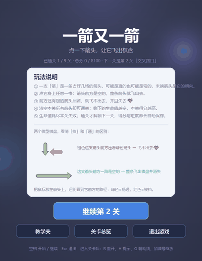

> 上面这段演示 GIF 由 `tools/make_demo_gif.py` 无头录制：悬停看路径 → 开辅助线、
> 点一次提示 → 点错丢一颗心 → 点对了整条箭头飞出去 → 连锁清空 → 通关结算。

**顺手给玩家配了三个小工具**（都摆在界面上，不用记快捷键）：

* **提示**：在「现在能飞出去的箭头」里自动挑一支**消掉之后能解锁最多其它箭头**的，
  套上一圈会呼吸的青绿高亮环，几秒后自己消失——不会一直挂着让人误以为那格有什么特殊状态；
* **辅助线**：把每支箭头箭头方向的去路用虚线画出来（去路畅通的画到棋盘边，
  被挡住的停在挡路那一格跟前）。两种情况**用同一个颜色**：它只帮你把方向关系看清楚，
  不替你做判断——真按「能不能飞」上色，等于把答案画在脸上；
* **缩放滑杆**：棋盘比窗口大时可以把画面放大（60%~180%），放大后按住棋盘就能拖动查看边角。
  默认 100% 恰好铺满棋盘视口。

**1 个教学关 + 9 个正式关卡**：教学关是**独立入口**（不计分、不占关卡编号、随时可以回去复习），
9 个正式关难度递增，棋盘从 **11×8 扩到 26×18**（都是**竖长方形**，贴合手机竖屏比例），
箭头从 **20 支增加到 46 支**，单支长度从 1 格散开到 18 格，四个方向混着指；
后期关卡里还掺了**带拐弯的蛇形箭**（C 形回折、S 形蜿蜒），教学关也会先带玩家认一支弯箭头。
所有关卡都由程序校验过可解性。

**关卡总览**：一眼看清每一关的通关状态、难度星级、棋盘规模与历史最高分；
**没通关前面一关，后面一关进不去**，点击锁着的关卡会提示先通关哪一关。
进度与分数自动保存在本机。

界面包含**开始界面、关卡总览、游戏界面、通关 / 失败 / 全部通关界面**，另有**设置面板**
（主题切换、清空进度、操作说明）。

---

## 二、游戏截图

全部 16 张截图都在**无头模式**下由脚本自动生成，见 `tools/make_screenshots.py`。

| 开始界面（标题 + 进度 + 按钮，规则交给教学关） | 关卡总览（3×3 卡片） |
| :---: | :---: |
|  | 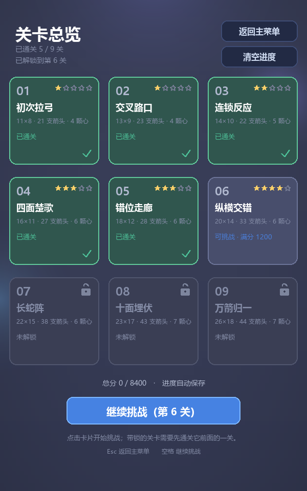 |

| 未解锁提示 | 教学关（高亮环 + 逐步讲解） |
| :---: | :---: |
| 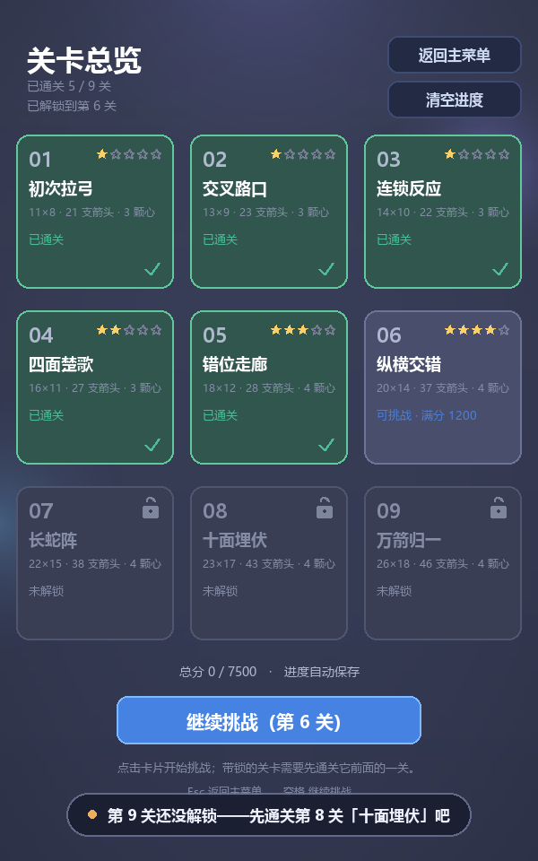 | 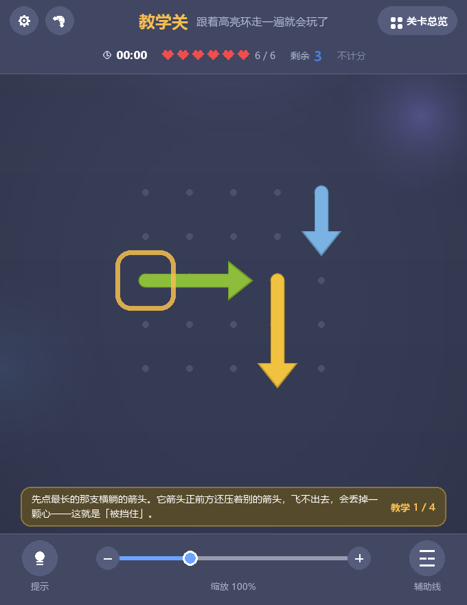 |

| 悬停：前方被挡住（红色） | 悬停：前方畅通（绿色） |
| :---: | :---: |
| 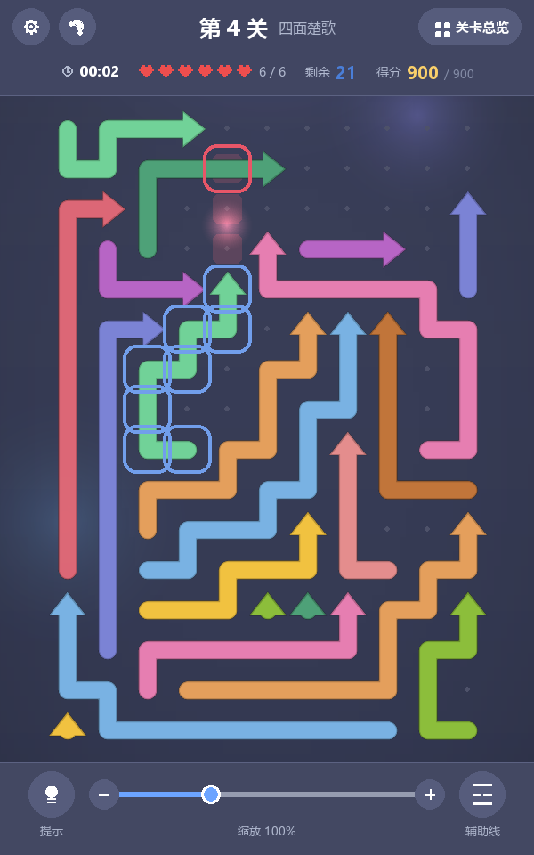 | 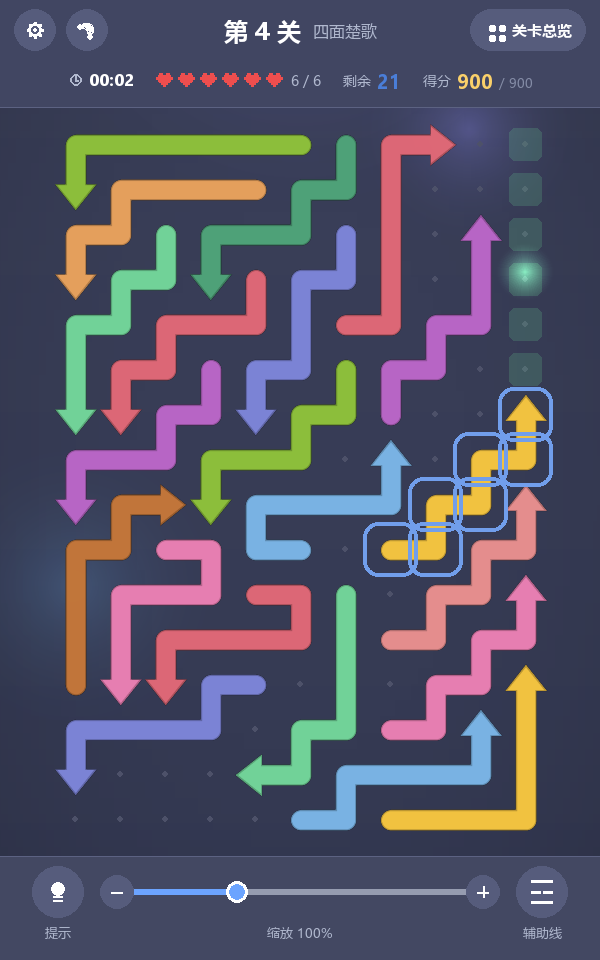 |

> 上面两张图拍的是**同一局面**，差别只在「箭头前方通不通」——放在一起才看得出
> 红色与绿色各自代表什么。

| 撞击反馈（被挡住，丢一颗心） | 飞出动画（整条箭头滑出棋盘） |
| :---: | :---: |
| 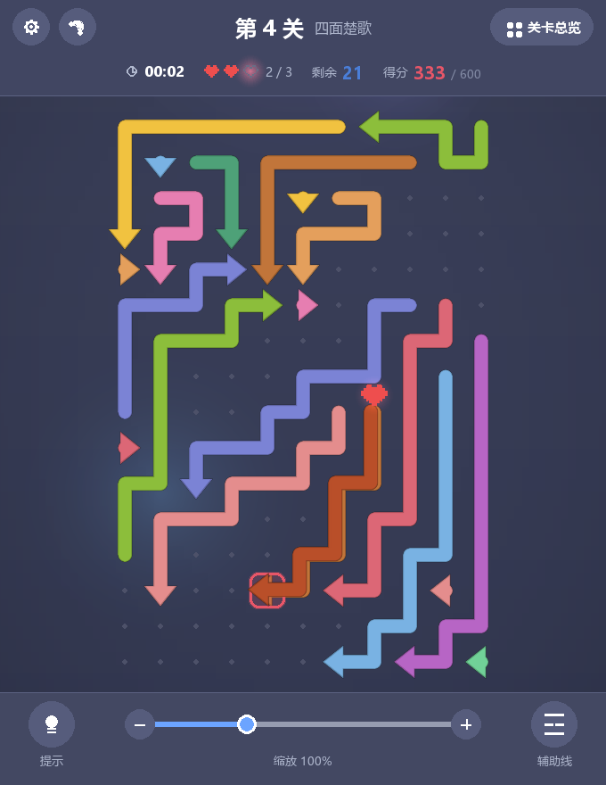 | 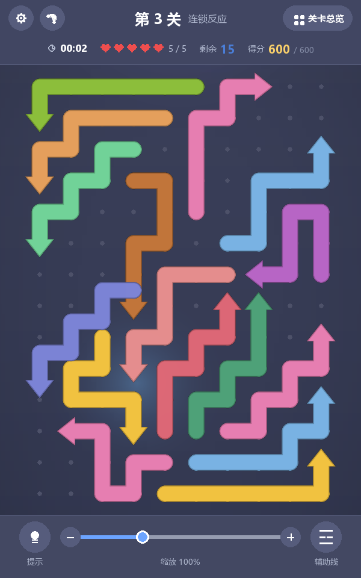 |

| 通关界面（含本关用时与得分） | 失败界面 |
| :---: | :---: |
| 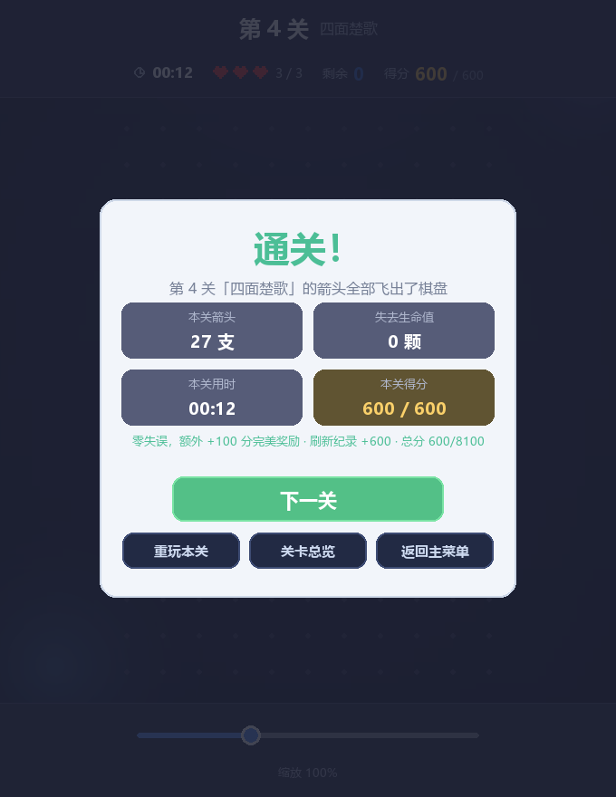 | 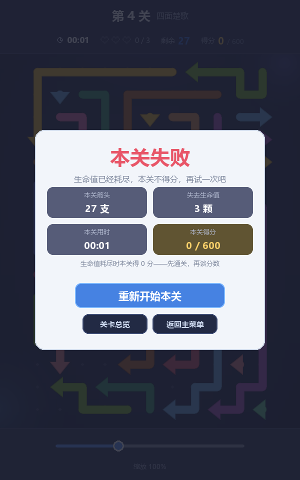 |

| 全部通关 | 最难的一关（26×18，46 支箭头） |
| :---: | :---: |
| 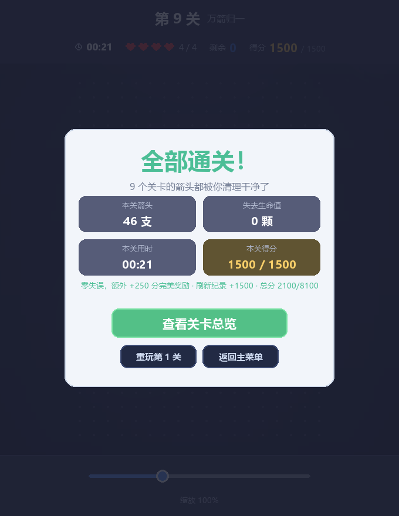 | 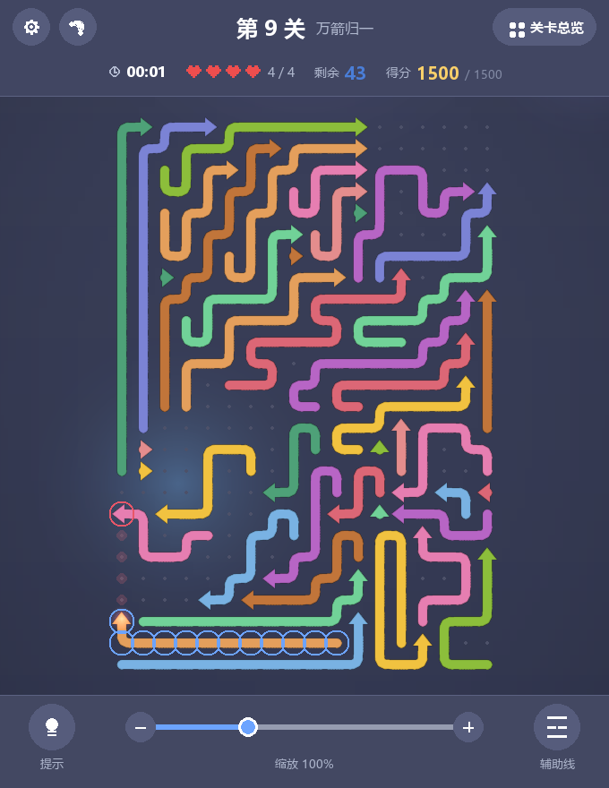 |

| 提示（高亮最值得先点的那一支） | 辅助线（画出每支箭头的去路） |
| :---: | :---: |
| 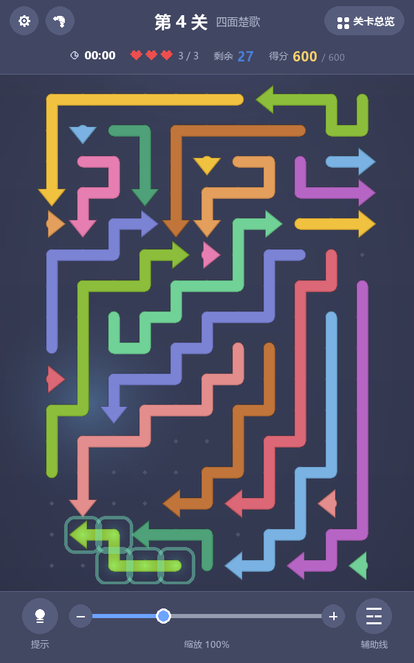 | 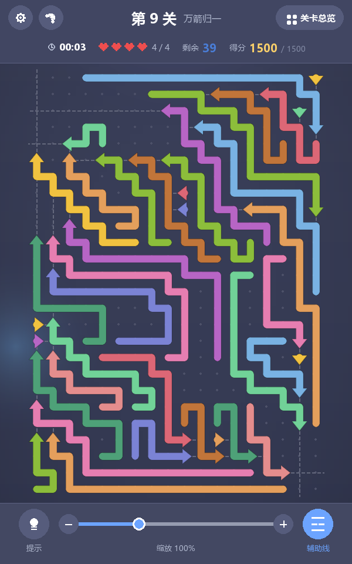 |

| 放大 + 拖动（180% 看边角） | 日间主题 + 设置面板 |
| :---: | :---: |
| 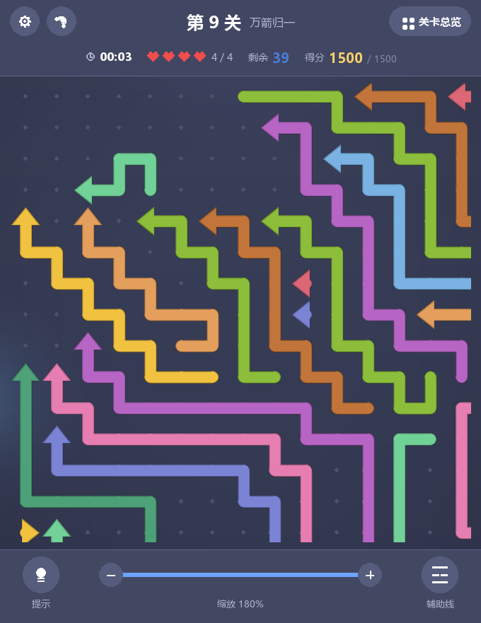 | 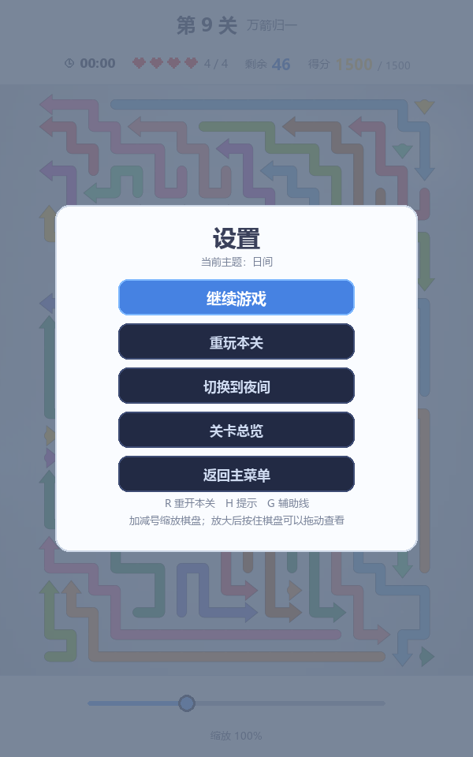 |

> 截图与 GIF 由 `tools/make_screenshots.py`、`tools/make_demo_gif.py` 在无头模式下自动生成，
> 改完界面重跑一次即可全部覆盖（共 16 张 PNG + 1 个 GIF）。
> 脚本一律**按状态找目标**（先问棋盘「哪一支被挡住了」再悬停过去），不写死坐标——
> 关卡数据一改，写死的坐标会静默指向别的箭头，截出来的图还是「能看」的，
> 只是已经不能说明它要说明的那件事了。

---

## 三、开发环境

| 项目 | 版本 / 说明 |
| --- | --- |
| 操作系统 | Windows 11（代码同时兼容 macOS / Linux） |
| Python | 3.11.3（3.9 及以上均可运行） |
| Pygame | 2.6.1 |
| Pillow | 12.3.0（仅录制演示 GIF 时需要，玩游戏不必装） |
| 编辑器 | 任意编辑器（VS Code / PyCharm 均可） |
| AIGC 工具 | 用于需求分析、代码编写、关卡生成、Bug 排查、测试用例设计（详见 `docs/blog.md`） |

字体说明：界面直接读取系统中文字体文件（优先 `msyh.ttc` 微软雅黑，其次 `simhei.ttf` 黑体等）。
若系统找不到任何中文字体，程序会在控制台给出警告并退化为默认字体。

---

## 四、安装与运行

### 1. 获取代码

```bash
git clone https://github.com/zsx123456/one-arrow-after-another.git
cd one-arrow-after-another
```

### 2. 安装依赖

```bash
pip install -r requirements.txt
```

若下载缓慢，可使用国内镜像：

```bash
pip install pygame -i https://pypi.tuna.tsinghua.edu.cn/simple
```

### 3. 运行游戏

```bash
python main.py
```

第一次运行会停在开始界面，点「教学关」可以先熟悉规则，点「开始游戏」直接进第 1 关。
此后每次启动都会读取项目根目录的 `progress.json` 接着上次继续
（该文件已加入 `.gitignore`，属于本机状态，不会上传；删掉它就等于从头开始）。

### 4. 运行测试

```bash
python tests/test_game.py
# 或者
python -m unittest discover -s tests -v
```

### 5. 校验关卡是否可解

```bash
python tools/verify_levels.py             # 可读报告（含布局图与参考通关顺序）
python tools/verify_levels.py --markdown  # Markdown 表格，写报告时可复制
```

### 6. 重新生成截图 / 演示 GIF

```bash
python tools/make_screenshots.py   # 16 张 PNG -> assets/
python tools/make_demo_gif.py      # 演示动画   -> assets/demo.gif（需要 Pillow）
```

两个脚本都用**临时目录里的存档**，不会动你自己那份 `progress.json`。

### 7. 批量生成新关卡（可选）

```bash
python tools/generate_levels.py                                   # 按预设难度阶梯生成候选
python tools/generate_levels.py -r 14 -c 10 -n 20 -k 6 --seed 123  # 自定义尺寸与箭头数
python tools/pick_levels.py                                       # 从候选里挑出难度台阶
```

生成器用「逆向构造法」保证布局**必然可解**；`pick_levels.py` 再从同一尺寸的候选里
挑「开局可点数达标 + 朝向最均衡 + 铺满率最高」的那一版。详见文件开头的说明。

---

## 五、游戏操作说明

| 操作 | 说明 |
| --- | --- |
| 鼠标左键点击箭头 | 点它身上**任意一格**都算选中它；箭头前方空则整条飞出，被挡则丢一颗心 |
| 鼠标悬停在箭头上 | 高亮显示它的前进路径：**绿色 = 畅通，红色 = 被挡**，红色停在挡路的那一格 |
| 底栏圆钮「提示」 | 高亮一支「点掉它最能解锁局面」的箭头，几秒后自动消失（快捷键 `H`） |
| 底栏圆钮「辅助线」 | 开关；打开后给每支箭头画出它箭头前方的去路（虚线，快捷键 `G`） |
| 底栏缩放滑杆 `−` / `+` | 缩放棋盘 60%~180%；放大后按住棋盘可拖动查看（快捷键 `+` / `-`） |
| 顶栏齿轮 | 打开设置面板（主题切换 / 重新开始本关 / 重玩本关 / 清空进度 / 返回主菜单 / 退出游戏） |
| 顶栏月亮 / 太阳 | 切换夜间 / 日间主题 |
| 顶栏胶囊「关卡总览」 | 打开关卡总览 |
| 鼠标左键点击关卡卡片 | 已解锁的直接开局；未解锁的会提示先通关哪一关 |
| 键盘 `R` | 重新开始当前关卡 |
| 键盘 `H` / `G` | 提示 / 辅助线开关 |
| 键盘 `+` / `-` | 放大 / 缩小棋盘 |
| 键盘 `空格` | 在开始界面或关卡总览里继续挑战 |
| 键盘 `Esc` | 关掉浮层面板；否则返回主菜单（在开始界面按下则退出游戏） |

### 游戏界面元素

界面自上而下分成三块：**顶部信息栏 / 棋盘 / 底部工具栏**。

**顶部信息栏**

* 上面一行：左侧齿轮（设置）与昼夜开关，中间是标题，右侧胶囊「关卡总览」；
* 中间标题：编号关卡写「第 N 关 + 关卡名」，教学关写「教学关 + 跟着高亮环走一遍就会玩了」；
* 下面一行四组信息横排，**整体居中**：🕐 **本关用时** · 生命值（像素心，`3 / 4`）·
  **剩余箭头数** · **本关得分 / 本关满分**（教学关这一格写「不计分」）。

> 这一行为什么要自适应居中：心数会随关卡变化（3~4 颗）、得分位数也会变，
> 早期用一串写死的 x 坐标，每加一点内容都要人工核算会不会互相压住；
> 现在先量出四组的真实宽度、再整体居中，内容怎么变都不会撞在一起。
> `tests/test_game.py` 里有一条用例按「最宽的一组内容」量过这件事。

**棋盘**

* 不画每一格的底框，只用一片**极淡的点阵**标出网格位置——
  几十个空方框会把视线一直拽住，那是「乱」不是「难」；
* 箭头是一条**圆角粗箭头**，末端一个三角箭头；颜色取自一组糖果色，
  但**相邻（上下左右）的两支箭头不允许同色**——同色箭头挨在一起会连成一片、数不清有几支；
* 悬停任意一格会显示它所属箭头的去路；被挡时红段会停在挡路的那一格，再往后不画
  （后面的格子跟「为什么飞不出去」没有关系）。

**底部工具栏**

* 左边圆钮「提示」、中间缩放滑杆与百分比、右边圆钮「辅助线」（开关打开时圆钮和它下面的字都变成蓝色）
* 教学关额外有：目标箭头上的黄色呼吸高亮环 + 底部的逐步讲解条

### 生命值怎么来的

生命值上限**按关卡序号给**：第 1~4 关 3 颗心、第 5~9 关 4 颗心
（`game/levels.py` 的 `HP_BY_LEVEL`，每关数据里也带着 `hp` 字段）。
前期棋盘小、要扫的射线少，3 颗足够；后期棋盘大、步步都要算，多给一颗。
早年按难度星级给 4~7 颗，实测太宽松，改紧之后每一次点错都要掂量一下。
教学关不参与计分，单独给 6 颗心，是个随便点的沙盒。

### 分数怎么算的

```
基础分   = 难度星级 × 250                      难度越高底分越高（1 星 250 … 5 星 1250）
本关得分 = 基础分 × 剩余生命值 ÷ 生命值上限
完美奖励 = 一颗心都没丢时，再额外 +20% 基础分
```

于是每关满分正好是「星级 × 300」，9 关合计 **7500 分**。失败（心用光）本关 0 分，
重玩只保留最高分。规则实现在 `game/scoring.py`，累计 6 个用例覆盖。

> 顶栏显示的「本关得分」是**此刻还能拿到的分数**，不是「已经拿到的分数」：
> 只要不再点错，通关就拿这个分；点错一次它会立刻往下掉。

---

## 六、项目结构

```
one-arrow-after-another/
├── main.py                   # 游戏入口：初始化窗口、主循环
├── requirements.txt          # 依赖清单
├── README.md
├── assets/                   # 游戏截图与演示 GIF
│   ├── demo.gif
│   └── shot-01 ~ shot-16.png
├── docs/
│   ├── blog.md               # 作业博客：AIGC 使用记录 + 测试记录 + PSP
│   └── test-report.md        # 测试与关卡校验的完整结果
├── game/                     # 游戏源码（逻辑与界面分离）
│   ├── config.py             # 全局配置：窗口、布局、两套主题配色、字体、动画参数
│   ├── pieces.py             # 棋子模型：折线箭头、方向、射线、布局校验、相邻不同色
│   ├── board.py              # 棋盘核心逻辑：点击、路径检测、飞出、生命值、胜负判定（不依赖 pygame）
│   ├── levels.py             # 关卡数据：箭头写法 + 教学步骤 + 难度评级 + 生命值表 + 校验
│   ├── scoring.py            # 得分规则（纯函数，不依赖 pygame）
│   ├── progress.py           # 闯关进度：解锁规则、最高分、JSON 存档（不依赖 pygame）
│   ├── ui.py                 # 绘图工具：字体、文字折行、按钮、滑杆、小图标、像素心与挂锁
│   ├── anim.py               # 动画效果：整条箭头飞出、撞击抖动、飘字、心碎
│   ├── bgfx.py               # 动态背景：漂移光晕 + 暗角（星点与流星已按参考图关掉）
│   └── app.py                # 游戏主体：三场景状态机、教学引导、提示/辅助线/缩放、事件分发、渲染
├── tools/
│   ├── verify_levels.py      # 关卡可解性校验脚本（含布局图与参考通关顺序）
│   ├── generate_levels.py    # 关卡生成器（逆向构造，保证可解）
│   ├── pick_levels.py        # 从候选里挑关卡（朝向均衡 + 铺满率，可点数只做软偏好）
│   ├── _showcase.py          # 截图/动图共用的「取景」策略（按状态找目标、临时存档）
│   ├── make_screenshots.py   # 无头模式批量截图脚本
│   ├── make_demo_gif.py      # 无头模式录制演示 GIF
│   └── sync_test_log.py      # 把 test-report 里的「完整测试日志」块与真实用例同步
└── tests/
    └── test_game.py          # 自动化测试（230 个用例）
```

### 代码设计要点

1. **逻辑与界面分离**：`board.py`（棋盘规则）、`pieces.py`（棋子几何与校验）、`progress.py`（解锁规则）、
   `scoring.py`（得分）里只有纯 Python 逻辑，一律不 import pygame，因此规则相关的测试不需要创建窗口，
   跑得飞快也不会因为环境而失败。
2. **单一状态入口**：所有对棋盘的修改都走 `Board.click(row, col)`，
   它返回一个 `ClickResult`（`fly` / `blocked` / `empty` / `ignored`），
   界面层根据返回值决定播放哪种动画，逻辑和表现互不干扰。
3. **关卡即文本**：一支箭头写成一行字符串，`行,列 方向 路径`，改关卡不用碰代码：

   ```python
   # "4,6 > D3R2"：从第 4 行第 6 列出发，箭头朝右，
   # 箭头先向下 3 格、再向右 2 格，共 6 格；箭头在最后经过的那一格
   Level(
       name="交叉路口",
       hint="开局能点的很少，先找朝外的",
       max_hp=4,
       rows=13, cols=9,
       specs=(
           "2,0 > R2",
           "2,3 v D2",
           # ...
       ),
   )
   ```

   写法由 `pieces.parse_piece` 解析，宽进严出：路径段可省略（`"5,0 <"` 就是只占一格朝左的短箭）、
   可小写、多余空格会被折叠。**注意不能对整串调用 `upper()`**——方向字符里的 `v`（向下）
   大写会变成 `V`，而方向表里认的是小写 `v`，那样所有朝下的箭头都会解析失败。
4. **非法布局导入即报错**：`pieces.validate_layout` 检查「都在盘内、互不重叠、逐格相邻、不自交、
   **末端一段必须和箭头方向一致**（否则箭头会歪在拐角上）、
   **射线不能穿过自己的身体**（否则这支箭永远飞不出去）」。
5. **关卡可解性由程序保证**：`solve_level()` 用贪心法求解（消除箭头只会让射线更空，
   具有单调性，因此贪心是完备的），无解布局会在校验脚本和单元测试中直接报错。
   九个正式关全部由 `tools/generate_levels.py` 逆向构造生成，从构造方式上就保证了可解。
6. **相邻不同色用贪心染色**：`pieces.assign_colors` 挨个处理每支箭头，挑一个邻居没用过的颜色。
   颜色只影响好看与否，不参与任何规则判断。
7. **教学引导要能自愈**：玩家不按提示点是很正常的，
   所以每一步在展示前都会和棋盘状态对一次账，失效的步骤自动跳过（见 `Game.sync_tutorial()`）。
8. **界面分区由常量推导，不靠眼睛量**：信息栏 / 棋盘 / 工具栏的高度各是一个常量，
   `layout_board()` 和测试 `test_play_layout_areas_do_not_overlap()` 都从这几个常量算位置。
   改任何一个数字，测试会直接告诉你「哪一关的棋盘压到工具栏上了」，
   不用去 9 个关卡里逐关截图看。

### 核心代码：路径检测

```python
def path_cells(self, piece):
    """该箭头箭头前方、直到棋盘边界的全部格子坐标（不含箭头自己）。"""
    return piece.ray(self.rows, self.cols)

def path_to_blocker(self, piece):
    """返回 (射线上到挡路那支为止的格子, 挡路的箭头)，通畅时是 (整条射线, None)。

    「挡路的格子」并不等于「挡路那支的箭头」——一支箭头是好几格，
    压在射线上的一般是它的**身子**，箭头可能在很远的另一头。
    早先在界面里直接写 path.index(blocker.head)，只要挡路那支的箭头
    不在射线上就会抛 ValueError（悬停到这类箭头上就崩）。
    """
    path = self.path_cells(piece)
    own = self.grid[piece.head[0]][piece.head[1]]
    for index, (row, col) in enumerate(path):
        other = self.grid[row][col]
        if other is not None and other != own:
            return path[:index + 1], self.pieces[other]
    return path, None
```

### 核心代码：解锁规则

```python
def highest_unlocked(self, total):
    """返回当前解锁的最大关卡下标（第 1 关永远解锁）。"""
    unlocked = 0
    for index in range(max(0, total - 1)):
        if index in self.cleared:
            unlocked = index + 1       # 通关了才把下一关放出来
        else:
            break                      # 遇到第一个没通关的关卡就停下
    return unlocked
```

---

## 七、关卡设计

### 教学关（独立入口，不计分）

| 关卡 | 棋盘 | 箭头数 | 占格 | 生命值 | 引导步骤 |
| --- | --- | --- | --- | --- | --- |
| 教学关 | 5×5 | 3 | 8 | 6 | 4 步：点错感受碰撞 → 点对飞出 → 回头点第一支 → 清空通关 |

### 9 个正式关卡

| 关卡 | 名称 | 棋盘 | 箭头数 | 占格 | 铺满率 | 开局可直接点掉的箭头 | 生命值 | 难度 | 本关满分 |
| --- | --- | --- | --- | --- | --- | --- | --- | --- | --- |
| 第 1 关 | 初次拉弓 | 11×8 | 21 | 81 | 0.92 | 5 | ♥×3 | ★ | 300 |
| 第 2 关 | 交叉路口 | 13×9 | 23 | 107 | 0.91 | 7 | ♥×3 | ★ | 300 |
| 第 3 关 | 连锁反应 | 14×10 | 22 | 128 | 0.91 | 6 | ♥×3 | ★ | 300 |
| 第 4 关 | 四面楚歌 | 16×11 | 27 | 163 | 0.93 | 4 | ♥×3 | ★★ | 600 |
| 第 5 关 | 错位走廊 | 18×12 | 28 | 199 | 0.92 | 5 | ♥×4 | ★★★ | 900 |
| 第 6 关 | 纵横交错 | 20×14 | 37 | 259 | 0.93 | 3 | ♥×4 | ★★★★ | 1200 |
| 第 7 关 | 长蛇阵 | 22×15 | 38 | 304 | 0.92 | 4 | ♥×4 | ★★★★ | 1200 |
| 第 8 关 | 十面埋伏 | 23×17 | 43 | 360 | 0.92 | 6 | ♥×4 | ★★★★ | 1200 |
| 第 9 关 | 万箭归一 | 26×18 | 46 | 432 | 0.92 | 6 | ♥×4 | ★★★★★ | 1500 |

> 满分合计 **7500**。九关全部由 `tools/generate_levels.py` 逆向构造生成，
> 再用 `tools/pick_levels.py` 从候选里挑出来（同一尺寸挑「开局可点数达标 +
> 朝向最均衡 + 铺满率高 + 箭头长短差距大」的那一版，单支长度 1~18 格不等，
> 九关的最大单朝向占比压在 26%~45%，四个方向都看得到箭头）。
>
> 棋盘尺寸一律取**竖着的**（行数 > 列数）：这个游戏按手机竖屏比例做
> （窗口 680×880，棋盘视口约 652×648），竖长方形的棋盘才能把视口填满，
> 不至于上下各空出一条。

**难度是怎么控制的**

这个玩法有个容易被忽略的性质：点掉一支能飞出去的箭头，只会让其它箭头的射线更空，
所以**任何一步正确操作都不会把自己玩死**——不存在「顺序错误」，
唯一会输的方式是点了一支其实被挡住的箭头。
因此难度只来自一件事：**在棋盘上找出此刻哪些箭头的前方是空的**。

* **开局可直接点掉的箭头越少**，越要在开局就仔细扫视；**棋盘越大、箭头越多**，
  需要顺着看的行与列越多；
* 真正决定手感的是**开局可点数**：第 1 关 5 支起步，第 6 关收到 3 支；
  后期为了画面朝向均衡放宽到 4~6 支，由更紧的生命值（3/4 颗）补回来；
* 生命值上限按关卡序号给（第 1~4 关 3 颗、第 5~9 关 4 颗），是「容错」而不是「惩罚」。

难度分按 `箭头数 × 1.6 + 棋盘格数 × 0.12 − 开局可点数 × 3.0` 计算，
再按阈值 `(<35, <55, <75, <100, 其余)` 映射成 1~5 颗星。
九个关卡的难度分是 29.2 / 29.8 / 34.0 / 52.3 / 55.7 / 83.8 / 88.4 / 97.7 / 111.8，
映射成 1/1/1/2/3/4/4/4/5 星，一路单调递增，测试里有一条用例卡着这个阶梯。
完整的布局图与参考通关顺序见 `docs/test-report.md`。

---

## 八、测试结果

`python tests/test_game.py` 共 **230 个用例全部通过**，覆盖作业要求的 T01–T06：

| 编号 | 测试内容 | 预期结果 | 实际结果 |
| --- | --- | --- | --- |
| T01 | 点击前方无阻挡的箭头 | 整条箭头飞出棋盘并消失 | ✅ 通过 |
| T02 | 点击前方有阻挡的箭头 | 箭头不消失，生命值减 1 | ✅ 通过 |
| T03 | 点击箭头朝向棋盘外的箭头 | 箭头正常消失，不发生越界错误 | ✅ 通过 |
| T04 | 消除本关全部箭头 | 显示通关并进入下一关 | ✅ 通过 |
| T05 | 生命值耗尽 | 显示失败并允许重新开始 | ✅ 通过 |
| T06 | 游戏进行中重新开始 | 箭头布局和生命值恢复 | ✅ 通过 |

测试分成十一组：

| 测试类 | 覆盖内容 |
| --- | --- |
| `BoardRuleTestCase` | 棋盘规则、边界、点击箭头任意一格、生命值、胜负判定、`reset` |
| `SolverTestCase` | 求解器、关卡数据合法性、难度阶梯、棋盘竖屏尺寸、教学关数据 |
| `LevelBalanceTestCase` | 生命值按关卡序号给（3/4 颗）、星级从 1 铺到 5、难度分单调递增 |
| `ScoringTestCase` | 得分公式、完美奖励、失败 0 分、总分上限 |
| `ProgressTestCase` | 解锁规则、跳关不算解锁、存档读写与容错、最高分 |
| `RenderPrimitiveTestCase` | 文字折行与宽度、按钮命中、滑杆取值、绳子曲线采样、像素心图标 |
| `RopeCurveTestCase` | 折线拐弯圆滑成绳子曲线、C/S 形判定、蛇形箭生成仍合法可解 |
| `AnimationTestCase` | 整条箭头沿路径飞出（时长随弧长伸缩）、撞击抖动、飘字与心碎的生命周期 |
| `BackgroundTestCase` | 背景确实在动、暗角与光晕不越界 |
| `GameFlowTestCase` | 完整流程、场景渲染、开始界面排版、总览交互、教学引导、9 关顺序通关、计时 / 提示 / 辅助线 / 缩放平移、界面三块分区不重叠、辅助线几何（`guide_segment` 与被挡路径共线且落在挡路那一格内、箭头飞走后消失） |
| `VisualVarietyTestCase` | 相邻箭头不同色、日夜间主题两套配色都完整、箭头与箭头造型、背景元素 |

另有边界用例：点到空格子不丢心、点到棋盘外不报错、本关结束后点击无效、
死锁布局被判定为无解、非法关卡布局直接报错（含「箭头正对自己的箭头」）、
教学关缺步骤直接报错等。

详细测试过程与关卡校验输出见 [`docs/test-report.md`](docs/test-report.md)。

---

## 九、AIGC 使用说明

本项目使用 AIGC 工具辅助完成需求拆解、代码编写、Bug 排查、关卡批量生成与测试用例设计。
开发过程中 **23 次具有代表性的 AIGC 协作**（提出了什么要求、AI 给了什么、实际效果如何、
人工做了哪些修改）记录在 [`docs/blog.md`](docs/blog.md)，其中 20 次展开成了完整记录。

几个真实的「AI 写错、人改对」的例子：

* AI 最初生成的第 2 关布局是**无解**的（几支箭头首尾相接互相阻挡），通过校验脚本发现后调整布局解决；
* AI 写的关卡生成器**排序方向反了**，挑出来的全是「开局每支都能飞」的最简单布局，
  改成逆向构造 + 阻挡偏好后，开局可点数从两位数压到个位数；
* 提高难度本来想当然地以为「塞得越多越难」，实测**反而更简单**
  （贴边、朝棋盘外的箭头永远能飞），补上「排除空射线候选」的启发式才真正把难度提上去；
* 界面画辅助线时 AI 直接用了 `blocker.head`（挡路那支的**箭头**）当终点，
  只要挡路那支的箭头不在射线上就会斜穿整个棋盘连到方向无关的格子上；
  改成用「射线上被占的那一格」后才正确，并抽成 `guide_segment()` 加了 3 条测试盯住；
* 箭头改版后关卡**铺满率到了 92% 以上**，AI 第一次生成的截图里「绿色通畅路径」全都是空的
  ——铺满的盘面上射线长度为 0。补救办法是截图前先按解法点掉几步、盘面出现空档再拍；
* 演示 GIF 第一版有 8 MB，原因是给每帧加了 `disposal=2`，让 Pillow 放弃了帧间差分、
  每帧整幅写入；去掉之后体积降到 2.4 MB；
* 进度存档最初用 `pickle`，存档损坏会让游戏起不来，换成 JSON 并补上读写容错；
* 加完关卡后回归挂了 2 个用例，一个是测试依赖了「第 1 关长什么样」，
  另一个是「清空进度」按钮漏了状态复位；
* 开始界面第一版在标题下面塞了一整块「玩法说明」卡片（五行规则 + 两张示例小图），
  主按钮被挤到窗口底部，第一眼看到的是一大段字而不是「开始游戏」——整块删掉，
  规则交给教学关一步步演示，界面立刻清爽了。

---

## 十、常见问题

**Q1：界面里的中文显示成方块？**
系统里没有找到中文字体。程序会依次尝试 `msyh.ttc` / `simhei.ttf` / `Deng.ttf` 等文件，
Linux 下可先安装字体：`sudo apt install fonts-wqy-zenhei`。

**Q2：`ModuleNotFoundError: No module named 'pygame'`？**
依赖没有装到当前 Python 环境。用 `python -m pip install -r requirements.txt` 明确指定解释器安装。

**Q3：窗口太大 / 太小？**
修改 `game/config.py` 里的 `WINDOW_WIDTH`、`WINDOW_HEIGHT` 即可，棋盘会自动适配尺寸。

**Q4：箭头太细看不清？**
用底栏的缩放滑杆放大（最高 180%），放大后按住棋盘可以拖动。箭头粗细与箭头大小的比例
在 `game/config.py` 的 `PIECE_STROKE_RATIO` / `PIECE_HEAD_RATIO` 里，改完重跑一次截图脚本即可。

**Q5：想自己加关卡？**
在 `game/levels.py` 的 `LEVELS` 里加一个 `Level(...)`（箭头写成 `"行,列 方向 路径"`），
然后跑 `python tools/verify_levels.py` 确认新关卡可以通关即可；
`tools/generate_levels.py` + `tools/pick_levels.py` 也可以直接生成并挑出一批候选。

**Q6：怎么清掉闯关进度和分数？**
在「设置」面板里点「清空进度」（点两次确认），或者直接删掉项目根目录的 `progress.json`。
关卡总览里也有这个按钮。

**Q7：为什么后面的关卡点不进去？**
这是设计如此：**通关一关才会解锁下一关**。关卡总览里带挂锁图标的关卡需要先通关它前面那一关。

**Q8：`make_demo_gif.py` 报 `No module named 'PIL'`？**
录制 GIF 需要 Pillow：`python -m pip install pillow`。玩游戏本身不需要它。

**Q9：用了「提示」会不会影响得分或者留下记录？**
不会。提示和辅助线只是看棋盘的工具，既不扣分也不改存档，
用多少次都不影响本关能拿的分数。
