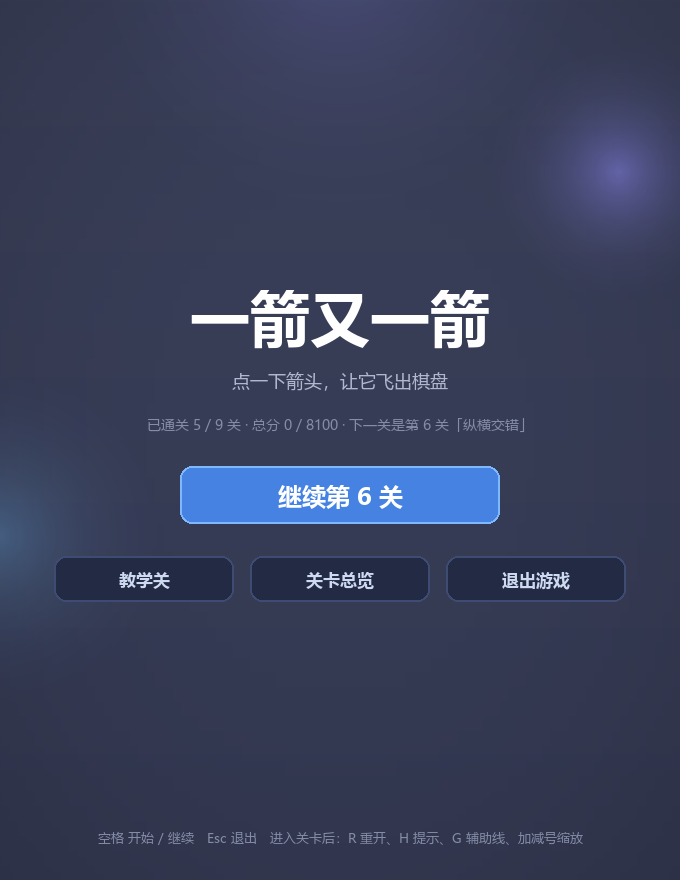
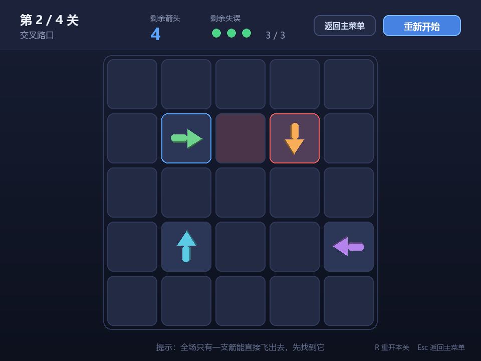
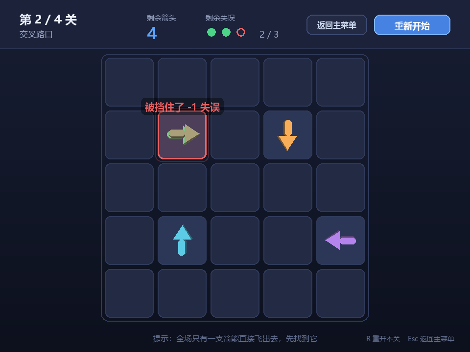
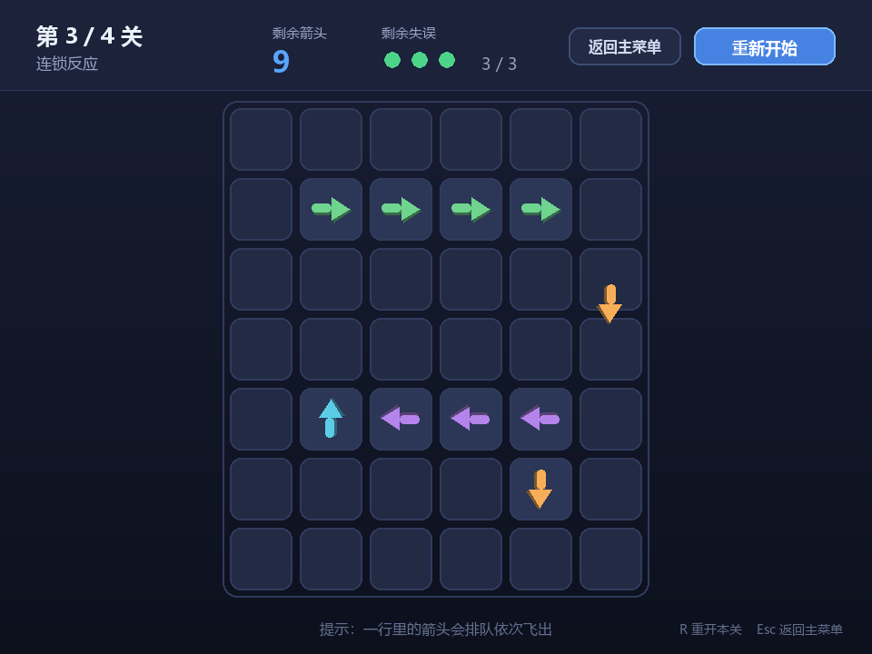
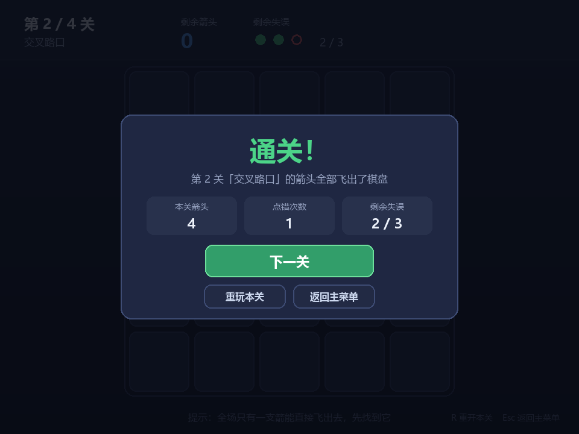
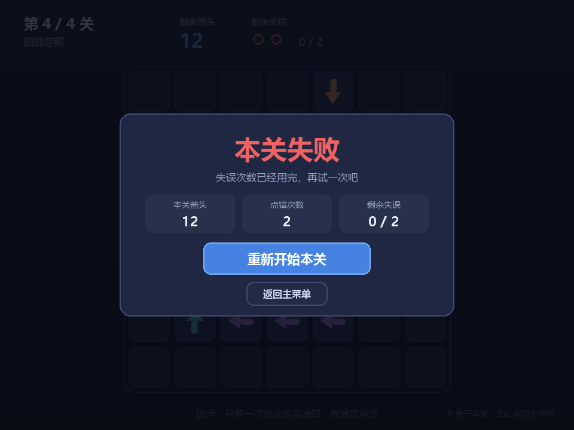
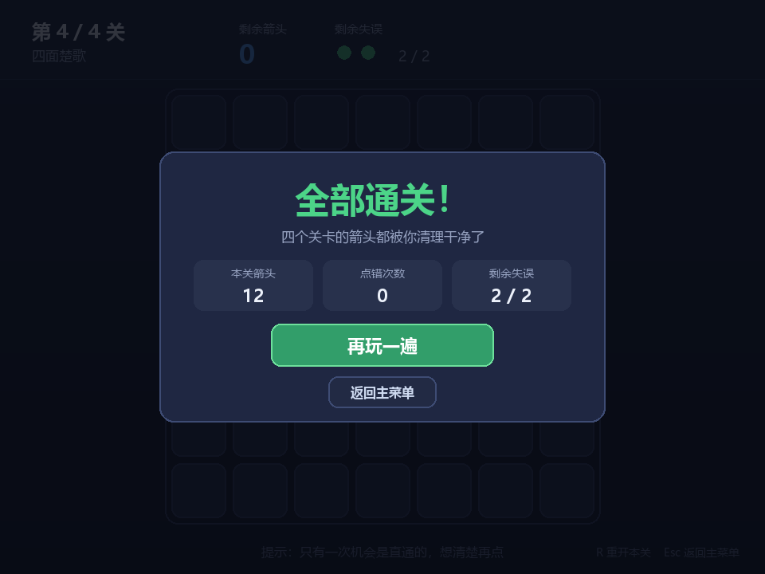

# 一箭又一箭（One Arrow After Another）

一个用 **Python + Pygame** 编写的点击式箭头解谜小游戏。项目为软件工程课程第二次个人作业，
参考微信小游戏《一箭又一箭》的核心玩法实现，开发过程使用 AIGC 工具辅助。

---

## 一、游戏简介

棋盘上散布着朝向「上 / 下 / 左 / 右」四个方向的箭头。玩家点击某个箭头：

* 如果它前进方向上**没有其它箭头阻挡**，箭头会沿着自己的方向飞出棋盘并被消除；
* 如果前进方向上**存在其它箭头**，箭头不会消失，而是前冲一下再弹回、抖动、泛红，并消耗一次失误机会；
* 清空本关全部箭头即可进入下一关；失误次数耗尽则本关失败，可以重新开始。

游戏包含**开始界面、游戏界面、通关 / 失败界面**，共 **4 个关卡**，每关都经过程序校验可正常通关。

---

## 二、游戏截图

| 开始界面 | 游戏界面（悬停显示路径） |
| :---: | :---: |
|  |  |

| 撞击反馈（被挡住） | 箭头飞出棋盘 |
| :---: | :---: |
|  |  |

| 通关界面 | 失败界面 |
| :---: | :---: |
|  |  |

| 全部通关 |
| :---: |
|  |

> 截图由 `tools/make_screenshots.py` 在无头模式下自动生成，可随时重新运行覆盖。

---

## 三、开发环境

| 项目 | 版本 / 说明 |
| --- | --- |
| 操作系统 | Windows 11（代码同时兼容 macOS / Linux） |
| Python | 3.11.3（3.9 及以上均可运行） |
| Pygame | 2.6.1 |
| 编辑器 | 任意编辑器（VS Code / PyCharm 均可） |
| AIGC 工具 | 用于需求分析、代码编写、Bug 排查、测试用例设计（详见 `docs/blog.md`） |

字体说明：界面直接读取系统中文字体文件（优先 `msyh.ttc` 微软雅黑，其次 `simhei.ttf` 黑体等）。
若系统找不到任何中文字体，程序会在控制台给出警告并退化为默认字体。

---

## 四、安装与运行

### 1. 获取代码

```bash
git clone https://github.com/<你的用户名>/one-arrow-after-another.git
cd one-arrow-after-another
```

### 2. 安装依赖

```bash
pip install -r requirements.txt
```

若下载缓慢，可使用国内镜像：

```bash
pip install pygame -i https://pypi.tuna.tsinghua.edu.cn/simple
```

### 3. 运行游戏

```bash
python main.py
```

### 4. 运行测试

```bash
python tests/test_game.py
# 或者
python -m unittest discover -s tests -v
```

### 5. 校验关卡是否可解

```bash
python tools/verify_levels.py
```

### 6. 重新生成游戏截图

```bash
python tools/make_screenshots.py
```

---

## 五、游戏操作说明

| 操作 | 说明 |
| --- | --- |
| 鼠标左键点击箭头 | 让箭头尝试飞出棋盘；被挡住则消耗一次失误 |
| 鼠标悬停在箭头上 | 高亮显示它的前进路径：**绿色 = 畅通，红色 = 被挡**，红色边框标出挡路的箭头 |
| 鼠标左键点击按钮 | 开始游戏 / 重新开始 / 下一关 / 返回主菜单 |
| 键盘 `R` | 重新开始当前关卡 |
| 键盘 `Esc` | 返回主菜单（在开始界面按下则退出游戏） |
| 键盘 `空格` | 在开始界面直接开始第 1 关 |

### 游戏界面元素

* 左上角：当前关卡序号（第 x / 4 关）与关卡名称
* 顶部中间：**剩余箭头数**
* 顶部偏右：**剩余失误次数**（实心圆点 = 还能错几次，空心红圈 = 已经用掉）
* 右上角：**返回主菜单**、**重新开始**按钮
* 底部：本关提示、快捷键说明

---

## 六、项目结构

```
one-arrow-after-another/
├── main.py                   # 游戏入口：初始化窗口、主循环
├── requirements.txt          # 依赖清单
├── README.md
├── assets/                   # 游戏截图
│   └── shot-*.png
├── docs/
│   ├── blog.md               # 作业博客：AIGC 使用记录 + 测试记录
│   └── test-report.md        # 测试与关卡校验的完整结果
├── game/                     # 游戏源码（逻辑与界面分离）
│   ├── config.py             # 全局配置：窗口、布局、配色、字体、动画参数
│   ├── board.py              # 棋盘核心逻辑：路径检测、飞出、失误、胜负判定（不依赖 pygame）
│   ├── levels.py             # 关卡数据：ASCII 布局 + 解析 + 整体校验
│   ├── ui.py                 # 绘图工具：字体、文字、按钮、箭头图形
│   ├── anim.py               # 动画效果：飞出、撞击抖动、飘字
│   └── app.py                # 游戏主体：场景状态机、事件分发、渲染
├── tools/
│   ├── verify_levels.py      # 关卡可解性校验脚本
│   └── make_screenshots.py   # 无头模式批量截图脚本
└── tests/
    └── test_game.py          # 自动化测试（T01–T06 及边界用例）
```

### 代码设计要点

1. **逻辑与界面分离**：`board.py` 里只有纯 Python 规则逻辑，不 import pygame，
   因此规则相关的测试不需要创建窗口，跑得飞快也不会因为环境而失败。
2. **单一状态入口**：所有对棋盘的修改都走 `Board.click(row, col)`，
   它返回一个 `ClickResult`（`fly` / `blocked` / `empty` / `ignored`），
   界面层根据返回值决定播放哪种动画，逻辑和表现互不干扰。
3. **关卡即文本**：关卡用 ASCII 字符描述，`.>v<^` 一眼看懂，改关卡不用碰代码：

   ```python
   Level(
       name="交叉路口",
       hint="全场只有一支箭能直接飞出去，先找到它",
       max_mistakes=3,
       layout=(
           ".....",
           ".>.v.",
           ".....",
           ".^..<",
           ".....",
       ),
   )
   ```

4. **关卡可解性由程序保证**：`solve_level()` 用贪心法求解（消除箭头只会让路径更空，
   具有单调性，因此贪心是完备的），无解布局会在校验脚本和单元测试中直接报错。

### 核心代码：路径检测

```python
def path_cells(self, row, col):
    """该箭头前进方向上、直到棋盘边界的全部格子坐标（不含自身）。"""
    arrow = self.grid[row][col]
    d_row, d_col = arrow.delta
    cells = []
    r, c = row + d_row, col + d_col
    while self.in_bounds(r, c):        # 只沿同一行或同一列推进
        cells.append((r, c))
        r += d_row
        c += d_col
    return cells

def find_blocker(self, row, col):
    """返回前进方向上第一个挡路的箭头；路径通畅返回 None。"""
    for r, c in self.path_cells(row, col):
        if self.grid[r][c] is not None:
            return self.grid[r][c]
    return None
```

---

## 七、关卡设计

| 关卡 | 名称 | 棋盘 | 箭头数 | 开局可直接点掉的箭头 | 失误上限 | 是否可解 |
| --- | --- | --- | --- | --- | --- | --- |
| 第 1 关 | 初次拉弓 | 5×5 | 5 | 3 | 3 | 是 |
| 第 2 关 | 交叉路口 | 5×5 | 4 | 1 | 3 | 是 |
| 第 3 关 | 连锁反应 | 7×6 | 10 | 2 | 3 | 是 |
| 第 4 关 | 四面楚歌 | 7×7 | 12 | 1 | 2 | 是 |

「开局可直接点掉的箭头」越少，容错空间越小，难度越高。
第 2 关和第 4 关都只有一支箭头是直通的，第 4 关还只给 2 次失误，是本作最难的一关。

完整的参考通关顺序见 `docs/test-report.md`。

---

## 八、测试结果

`python tests/test_game.py` 共 **23 个用例全部通过**，覆盖作业要求的 T01–T06：

| 编号 | 测试内容 | 预期结果 | 实际结果 |
| --- | --- | --- | --- |
| T01 | 点击前方无阻挡的箭头 | 箭头飞出棋盘并消失 | ✅ 通过 |
| T02 | 点击前方有阻挡的箭头 | 箭头不消失，失误次数减 1 | ✅ 通过 |
| T03 | 点击位于边缘且朝向棋盘外的箭头 | 箭头正常消失，不发生越界错误 | ✅ 通过 |
| T04 | 消除本关全部箭头 | 显示通关并进入下一关 | ✅ 通过 |
| T05 | 失误次数耗尽 | 显示失败并允许重新开始 | ✅ 通过 |
| T06 | 游戏进行中重新开始 | 箭头布局和失误次数恢复 | ✅ 通过 |

另有边界用例：点到空格子不扣失误、点到棋盘外不报错、本关结束后点击无效、
死锁布局被判定为无解、非法关卡布局直接报错、四个角落的箭头路径不越界等。

详细测试过程与关卡校验输出见 [`docs/test-report.md`](docs/test-report.md)。

---

## 九、AIGC 使用说明

本项目使用 AIGC 工具辅助完成需求拆解、代码编写、Bug 排查、关卡校验脚本与测试用例设计。
开发过程中 **6 次具有代表性的 AIGC 使用记录**（提出了什么要求、AI 给了什么、实际效果如何、
人工做了哪些修改）记录在 [`docs/blog.md`](docs/blog.md)。

几个真实的「AI 写错、人改对」的例子：

* AI 最初生成的第 2 关布局是**无解**的（4 支箭头首尾相接互相阻挡），通过校验脚本发现后调整布局解决；
* `pygame.font.SysFont()` 在本机读取字体注册表时崩溃，改为直接指定字体文件路径；
* 最初写的测试断言里把测试关卡的箭头数写成了 4 支（实际是 3 支），测试直接报错，按实际布局改正。

---

## 十、常见问题

**Q1：界面里的中文显示成方块？**
系统里没有找到中文字体。程序会依次尝试 `msyh.ttc` / `simhei.ttf` / `Deng.ttf` 等文件，
Linux 下可先安装字体：`sudo apt install fonts-wqy-zenhei`。

**Q2：`ModuleNotFoundError: No module named 'pygame'`？**
依赖没有装到当前 Python 环境。用 `python -m pip install -r requirements.txt` 明确指定解释器安装。

**Q3：窗口太大 / 太小？**
修改 `game/config.py` 里的 `WINDOW_WIDTH`、`WINDOW_HEIGHT` 即可，棋盘会自动适配尺寸。

**Q4：想自己加关卡？**
在 `game/levels.py` 的 `LEVELS` 里加一个 `Level(...)`，然后跑 `python tools/verify_levels.py`
确认新关卡可以通关即可。
